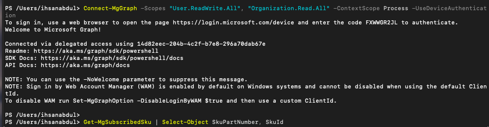
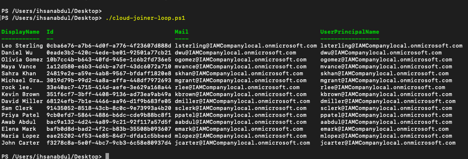

# Part 2 — Hybrid Cloud Integration (Entra ID)

### Overview
This portion of the project documents the extension of on-premises Active Directory identities into Microsoft Entra ID, and the automation of cloud lifecycle provisioning using Microsoft Graph.

The focus of this phase is identity synchronization and service activation. Making sure that users provisioned on-premises automatically exist in the cloud and are ready for service access without manual intervention.

## Table of Contents
- [Phase 1 — Identity Synchronization (Entra Connect)](#phase-1--identity-synchronization-entra-connect)
- [Phase 2 — Cloud Lifecycle Automation (Microsoft Graph)](#phase-2--cloud-lifecycle-automation-microsoft-graph)
- [Technical Skills Demonstrated](#technical-skills-demonstrated)
- [Outcome](#outcome)

---

## Phase 1 — Identity Synchronization (Entra Connect)

Following the on-premises setup, the next step was extending the local directory to the cloud.

### Implementation of Microsoft Entra Connect

- Downloaded and installed the Microsoft Entra Connect Sync Agent on the Windows Server 2022 Domain Controller.
- Configured Domain and OU filtering to target the `Corporate` OU specifically.
- This ensures only laboratory users and groups are synchronized, maintaining a clean cloud tenant.

#### Implementation Note
- By selecting "Sync selected domains and OUs," I prevented built-in system accounts and local infrastructure groups from cluttering the Entra ID portal, adhering to standard production best practices.

[View Entra Connect Download](images/cloud-01-entra-connect-download.png)

[View Domain/OU Filtering Configuration](images/cloud-02-syn-ou.png)

---

### Synchronization Troubleshooting (Time Skew)

The first synchronization attempt failed to sync users in the Entra ID tenant.

**Issue Identified:**
- The local VM system clock had drifted from the actual time.
- Entra ID authentication tokens require precise time synchronization. The mismatch caused the sync to fail the authentication with the cloud.

**Resolution:**
- Reconfigured the Windows Time service to sync from an external NTP source instead of the inaccurate local CMOS clock:

```powershell
w32tm /config /manualpeerlist:"time.windows.com,0x8" /syncfromflags:manual /update
Restart-Service W32Time
w32tm /resync /force
```

**Key Learning**
- In a hybrid environment, time synchronization is a critical dependency. Even a small drift can invalidate security tokens and break the identity pipeline between on-premises and cloud.

---

### Verification of Cloud Identities

Once the time sync was resolved, the synchronization cycle completed successfully.

**Results:**
- Verified 18 users found within the Entra ID **All Users** option.
- Confirmed identities are marked as **Synced from on-premises**, maintaining the local AD as the Source of Authority.
- Identities are created in an **Unlicensed** state, requiring a secondary automation step for service activation.

[View 18 users synchronized in Entra ID](images/cloud-03-synced-users.png)

---

## Phase 2 — Cloud Lifecycle Automation (Microsoft Graph)

This phase extends the Joiner lifecycle into the cloud, evolving from manual provisioning to a scalable automation model within Microsoft Entra ID.

### Remote Management Infrastructure (Graph Connection)

Before any provisioning could occur, a secure remote bridge was established to the cloud tenant. This represents the shift from local AD management to API-driven cloud administration.

**Implementation:**
- **Command:** `Connect-MgGraph -Scopes "User.ReadWrite.All", "Organization.Read.All" -ContextScope Process -UseDeviceAuthentication`
- **Access Model:** Delegated permissions with least privilege
- **Security:** Scopes were restricted specifically to User and Directory modifications to ensure a hardened management session

**Key Insight:**
- Cloud identity management is purely API-driven. Establishing a scoped, authenticated session is the first security boundary in cloud automation.




---

### Terminal Discovery: Inline Licensing & Attribute Challenge

After the synchronization, 18 users existed in Entra ID in an unlicensed state. A manual license assignment was attempted directly in the terminal to establish a baseline.

**Problem:**
Initial assignment failed with a `400 BadRequest`.

**Root Cause & Inline Validation:**
- **Discovery:** Microsoft 365 requires the `UsageLocation` attribute (ISO Country Code) to be defined before a licenses can be assigned.
- **Manual Fix:** The remediation was tested inline for a single user:
  - Updated attribute: `Update-MgUser -UserId <ID> -UsageLocation "CA"`
  - Re-ran license: `Set-MgUserLicense -UserId <ID> -AddLicenses @{SkuId = $LicenseID}`
- **Result:** Assignment succeeded, exposing a critical provisioning dependency:

**Identity → Attribute Remediation → License Assignment → Service Access**


---

### Tactical Scripting (cloud-joiner.ps1)

Once the manual fix was validated, the logic was moved into a reusable script to ensure the process was repeatable and included error handling.

**Technical Improvements:**
- Combined the attribute update and license assignment into a single try/catch block
- Used `Read-Host` to allow for targeted single-user provisioning

[Single Licensing script here:](scripts/01-cloud-single-user-joiner.ps1) 

**Engineering Bottleneck Identified:**
Prompting for a single user is not true automation, it is a digital workaround for a manual task that cannot scale across 18 users or an enterprise workforce.


---

### Enterprise Scaling: Provisioning Engine (cloud-joiner-loop.ps1)

The final iteration evolved into an autonomous engine that removes the human from the loop by programmatically identifying the workload.

**Key Features:**
- **Automated Discovery:** Queries the tenant for all users where `assignedLicenses/count -eq 0`, identifying unlicensed users without human input
- **Bulk Remediation:** Programmatically applies `UsageLocation` and license assignment across the entire list in a single execution
- **Operational Resiliency:** A failure on one account does not halt the entire provisioning batch

```powershell
foreach ($User in $TargetUsers) {
    try {
        Update-MgUser -UserID $User.Id -UsageLocation "CA"
        Set-MgUserLicense -UserID $User.Id -AddLicenses @{SkuId = $LicenseID}
    } catch { 
        Write-Host "Failed to license user: $($User.UserPrincipalName)" 
    }
}
```
[Automated Licensing script here:](scripts/02-cloud-bulk-joiner.ps1) 

This represents a shift from:

**Single-purpose terminal commands**

to:

**Modular, autonomous lifecycle automation**



---

### Execution Outcome

A full provisioning cycle was executed across all 18 synchronized laboratory identities.

**Results:**
- **Provisioning Success:** 100% transition from Unlicensed to Active
- **Attribute Integrity:** Confirmed `UsageLocation` (CA) applied consistently across the tenant
- **Service Readiness:** Enabled immediate access to Exchange Online and SharePoint Online for the incoming workforce


---

## Technical Skills Demonstrated

**Cloud Identity & Provisioning**
- Hybrid identity synchronization (Entra Connect)
- OU-scoped sync filtering
- Microsoft Graph API (delegated permissions, scoped access)
- Cloud license provisioning and attribute management

**PowerShell & Automation**
- API-driven cloud administration (Microsoft Graph module)
- Try/Catch error handling
- Loop-based bulk provisioning engine
- Inline terminal validation before scripting

**Security & Governance**
- Least privilege scope enforcement during Graph connection
- Provisioning dependency identification (UsageLocation requirement)
- Source of Authority maintenance (AD as master, Entra ID as extension)

**Troubleshooting**
- Time skew diagnosis and NTP remediation
- 400 BadRequest root cause analysis
- Manual-to-automated progression methodology

---

## Outcome

This phase demonstrates the transition from:

**Manual cloud provisioning**

to:

**Automated identity lifecycle management across hybrid systems**

It reflects real IAM responsibilities including:
- Hybrid identity synchronization
- Cloud attribute management
- Automated license provisioning at scale


