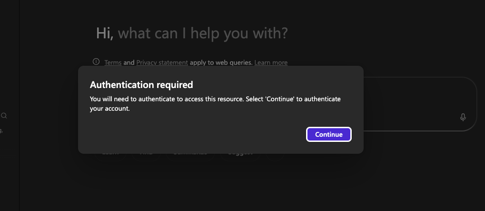
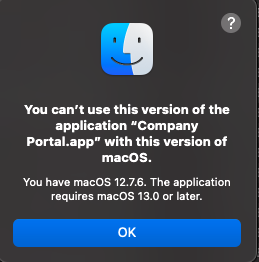
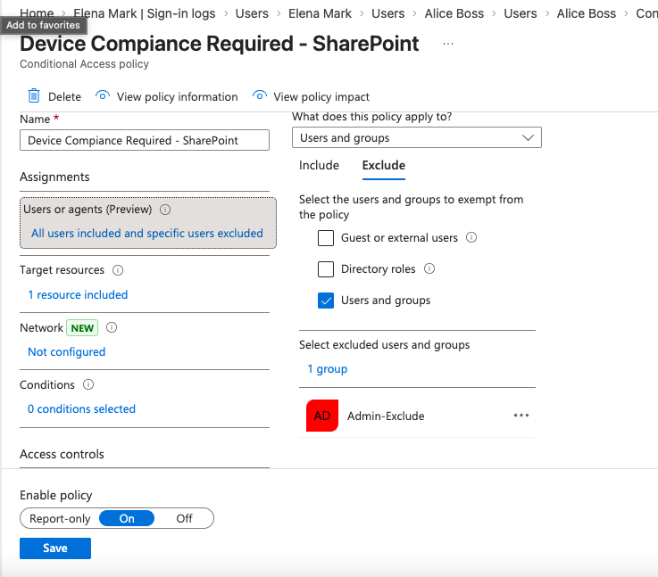

# Part 3: Governance and Security

## Overview

This final phase completes the hybrid setup by shifting the focus from identity creation to identity protection and oversight through Zero Trust access principles.

This phase demonstrates how to:
- Enforce context-aware access using Conditional Access and Intune
- Integrate modern SaaS applications via SSO protocols (SAML/OIDC)
- Maintain audit readiness through automated governance reporting

---

## Table of Contents
- [Phase 1 — Zero Trust Access Enforcement](#phase-1---zero-trust-access-enforcement-conditional-access-and-intune)
  - [Baseline MFA Policy](#baseline-mfa-policy)
  - [RBAC Enforcement (SharePoint Access Control)](#rbac-enforcement-sharepoint-access-control)
  - [Risk-Based Access Policy (SharePoint)](#risk-based-access-policy-sharepoint)
  - [Troubleshooting - Hardware Compatibility & The "Break Glass" Necessity](#troubleshooting---hardware-compatibility--the-break-glass-necessity)
  - [Device Trust (Intune Integration)](#device-trust-intune-integration)
  - [Enforcement Model](#enforcement-model)
  - [Key Outcome](#key-outcome)
- [Phase 2 — Modern Authentication (SSO Integrations)](#phase-2--modern-authentication-sso-integrations)
- [Phase 3 — Identity Governance (Access Review Reporting)](#phase-3--identity-governance-access-review-reporting)
- [Technical Skills Demonstrated](#technical-skills-demonstrated)
- [Outcome](#outcome)

---


## Phase 1 - Zero Trust Access Enforcement (Conditional Access and Intune)

In a hybrid environment, identity alone is not enough to grant access. This phase focuses on enforcing access controls based on **who** the user is, **what device** they are using, and **what resource** they are trying to access.


### Baseline MFA Policy

The first step was implementing a global Conditional Access policy in Microsoft Entra ID to enforce Multi-Factor Authentication across all cloud applications.

- Policy Logic:
  ```
  User = All Users
  App = All Cloud Apps
  Grant Access =  Require MFA
  ```

This establishes the baseline that valid credentials alone are not sufficient for access.


[View MFA User Prompt](images/02-mfa-policy-proof.png)

### Problem — Sensitive Data Requires Stronger Controls

- While MFA protects identity, it does not protect against access from compromised or unmanaged devices.

- In this environment, SharePoint is used as a central location for business data. Allowing access from any device introduces risk.

- This highlighted that MFA alone is insufficient for protecting sensitive resources. Additional controls based on device trust and application context are needed.

  
### RBAC Enforcement (SharePoint Access Control)

Before applying Conditional Access, access to SharePoint was structured using role-based access control to ensure permissions are assigned by role, not by individual.

**Group Structure:**

- `Finance_Analyst` (Global Group) → Members (edit access)
- `Finance_Manager` (Global Group) → Owners (full control)

This ensures access is determined by role assignment, not direct permission grants mirroring the AGDLP model implemented on-premises.

[View Finance Portal Members](images/04-sharepoint-finance-members.png)

[View Finance Portal Owners](images/05-sharepoint-finance-Owners.png)


### Risk-Based Access Policy (SharePoint)

A stricter Conditional Access policy was created specifically for SharePoint Online, requiring both MFA and a compliant device before access is granted.

**Policy Logic:**
```
User     = All Users
App      = SharePoint Online
Grant    = Require MFA
          + Require device marked as compliant
```


### Troubleshooting - Hardware Compatibility & The "Break Glass" Necessity

After enforcing the policy, a real-world failure scenario occurred. Immediately upon attempting to access SharePoint, I was met with a device authentication prompt requiring the Microsoft Intune Company Portal.




When I attempted to register my personal device, the process failed. My physical hardware (macOS) did not meet the Intune requirement. I was locked out of the M365 Admin Center and SharePoint.



**The Fix — Break-Glass Group Strategy:**

1. **Group Creation:** I created a Security Group named Admin-Exclude.

2. **Policy Exclusion:** I modified the Conditional Access policy to exclude this group, allowing me to bypass the hardware compliance requirement for administrative tasks.

3. **Identity Governance:** I added my admin account to this group, successfully restoring access to the M365 Admin Center.




 **Note:** *The `Admin-Exclude` group was also applied to the baseline MFA policy as a secondary precaution, ensuring administrative access is never fully blocked by a misconfigured policy.*
 

### What I Learned and Why This Matters**

In the enterprise, "Break-Glass" or Emergency Access Accounts are a non-negotiable security requirement:

- **Resilience:** If a primary identity provider (like an MFA service) goes down or a global policy is misconfigured, these accounts ensure the organization isn't permanently locked out of its own tenant

- **Zero Trust Balance:** This project highlights the delicate balance between high-security enforcement (Intune/MFA) and Business Continuity


### Device Trust (Intune Integration)

To support the device compliance requirement, compliance standards were defined in Microsoft Intune. Only devices meeting these conditions are considered trusted.

**Compliance Requirements:**

| Requirement | Purpose |
|-------------|---------|
| Password: Minimum 8 characters | Prevent brute-force attacks |
| Microsoft Defender Antimalware | Prevent unmanaged or non-compliant devices from entering the environment |
| Firewall enabled | Protect the endpoint in untrusted network environments |


### Enforcement Model

Access to SharePoint is only granted when all three conditions are satisfied simultaneously:

```
User Identity (MFA)
+
Device State (Compliant via Intune)
+
Resource Policy (SharePoint Conditional Access)
```

*This completes the Zero Trust access model: ***Verify Identity + Verify Device + Enforce Resource Policy***.*


### Outcome

This phase demonstrates the implementation of Zero Trust access controls:

- Identity alone is not trusted — MFA required
- Device health is verified — Intune compliance enforced
- Access is restricted based on resource sensitivity — SharePoint gets stricter controls than general apps
- Access is evaluated per request, not assumed

---


##Phase 2 — Modern Authentication (SSO Integrations)

###Overview

With Zero Trust access controls enforcing MFA and device compliance, the next step was enabling authentication across enterprise applications without introducing additional credentials.

This phase focuses on configuring SAML 2.0 Single Sign-On (SSO) in Microsoft Entra ID to integrate external applications, allowing users to authenticate once and access assigned resources through a centralized identity provider.

###SAML Application Integration

To demonstrate SSO, a custom SAML 2.0 application was configured in Microsoft Entra ID.

While modern applications often use OpenID Connect (OIDC), SAML remains widely used for enterprise SaaS integrations and legacy systems.


**Configuration:**

| Field | Value | Purpose |
|-------|-------|---------|
| Identifier (Entity ID) | `https://saml-test-app.com` | Uniquely identifies the application |
| Reply URL (ACS URL) | `https://jwt.ms` | Endpoint where the SAML assertion is sent |


The Reply URL was set to https://jwt.ms to allow validation of the SAML response without requiring a live application backend.


###Access Control — Group-Based Assignment

Following the AGDLP pattern established in Phase 1, access was granted using group membership rather than individual assignment, maintaining the RBAC model.

`Marketing_Staff_GG` was assigned to the application, ensuring that any user synced from the on-premises "Marketing" OU automatically receives SSO access upon migration to the cloud.

This enforces the Principle of Least Privilege. 

[Group Assignment](images/09-user-assignment.png)


### SAML Handshake Validation

To verify the handshake, SAML Tracer was used to capture and inspect the SAML response.

**1. User Experience Validation:**

First, I confirmed the application appeared correctly in the user's My Apps portal, proving the Entra ID assignment was active.

[My Apps Portal](images/12-apps-portal.png)


**2. Assertion validation (SAML Response):**

By intercepting the SAML POST request, the assertion issued by Entra ID was inspected.


|Element | Status | Validation |
|--------|--------|------------|
| Issuer | PASS | Matched Entra ID tenant (sts.windows.net). |
| Subject | PASS | Correct user `mvance@IAMCompanylocal.onmicrosoft.com`. |
| AttributeStatement | PASS | Confirmed that `givenname`, `surname`, and `email` were mapped correctly. |


### Troubleshooting — No Backend Application

**Issue:** 

The test application has no actual backend service to receive the SAML response.

**Fix:** 

- The SAML assertion is successfully generated by Entra ID
- The authentication handshake completes successfully
- The failure occurs at the final delivery stage because no application is listening at the Reply URL

- `jwt.ms` is optimized for OIDC/JWT tokens 
- doesn't naturally decode or display the XML packets used by the SAML protocol.

[Token Validation](images/10-saml-token-page.png)


###Key Outcome

This phase demonstrates SAML-based SSO integration within a hybrid identity environment:

***Configuration:*** SAML application configured with correct identifiers and endpoints
***Access Control:*** Role-based assignment aligned with AD group structure
***Validation:*** Successful SAML assertion issuance confirmed through traffic inspection
***Troubleshooting:*** Clear distinction between authentication success and application-layer failure


In this phase, I transitioned from securing Microsoft-native resources (SharePoint) to integrating external SaaS applications. This demonstrates the ability to act as a Centralized Identity Provider (IdP) for the entire enterprise.

### Protocol: SAML 2.0 (The Enterprise Standard)

I configured a SAML-based integration to demonstrate how legacy and enterprise web applications receive identity assertions.

Service Provider: jwt.ms (SAML Test Application)

Configuration: Defined Entity ID and Assertion Consumer Service (ACS) URL to establish a secure handshake.

Validation: Used SAML Tracer to intercept the XML assertion, verifying that attributes (UPN, Display Name) for the hybrid-synced user mvance were successfully passed.

[INSERT YOUR SAML TRACER SCREENSHOT HERE]


### Outcome
Technical Insight: The screenshot confirms the Subject matches the on-premises UPN, proving the end-to-end success of the Hybrid Identity lifecycle.


---

## Phase 3 - Identity Governance (Access Review Reporting)


