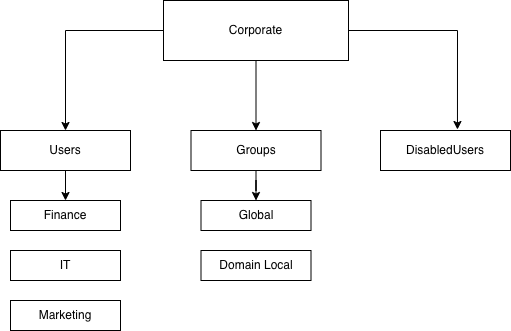

# Hybrid Identity & Governance Framework

## End-to-End IAM Automation — Active Directory, Microsoft Entra ID, and Identity Governance

---

### Project Overview

This project documents building a hybrid identity environment from the ground up.

The goal was not just to create users — but to manage their full lifecycle, control access, enforce security, and maintain governance visibility as identities move through an organization.

Built using Windows Server 2022, PowerShell, Microsoft Entra ID, Microsoft Graph, and Microsoft Intune.

Rather than designing a complete system upfront, this was built iteratively — each phase identifying a real limitation and solving it before moving forward. That approach is documented throughout.

---

### System Architecture

*Automated JML lifecycle workflow*

*Active Directory OU structure supporting RBAC and AGDLP group nesting*

---

## Table of Contents

**Project Sections**
- [Part 1 — On-Premises Infrastructure & Lifecycle](01-On-Prem-Infrastructure/README.md)
- [Part 2 — Hybrid Cloud Integration](02-Cloud-Automation/README.md)
- [Part 3 — Governance & Security](03-Governance-Compliance/README.md)

**Overview**
- [Technical Skills](#technical-skills)
- [Part 1 — On-Premises Summary](#part-1--on-premises-infrastructure--lifecycle)
- [Part 2 — Cloud Integration Summary](#part-2--hybrid-cloud-integration)
- [Part 3 — Governance & Security Summary](#part-3--governance--security)
- [Project Structure](#project-structure)

---

## Technical Skills

**Identity & Access Management**
- Identity lifecycle automation — Joiner, Mover, Leaver (JML)
- Role-Based Access Control (RBAC) using AGDLP model
- Least privilege enforcement and permission creep prevention
- Hybrid identity synchronization (on-premises AD as Source of Authority)
- Privileged access identification and risk classification

**Cloud & Modern Authentication**
- Microsoft Entra ID — user provisioning, group management, licensing
- Microsoft Graph API — delegated permissions, bulk provisioning automation
- Entra Connect — OU-scoped sync filtering, NTP troubleshooting
- SAML 2.0 SSO — application configuration, assertion validation
- OIDC — protocol understanding and use case differentiation

**Security & Zero Trust**
- Conditional Access policy design — baseline MFA and resource-scoped policies
- Device compliance enforcement via Microsoft Intune
- Break-glass and emergency access account strategy
- Zero Trust access model — identity + device + resource context

**Identity Governance**
- Inactive account detection using `LastLogonDate` thresholds
- Privileged access review through group membership analysis
- RBAC drift detection — validating access alignment against role and department
- Permission creep detection — flagging unexpected group memberships
- Governance report generation via CSV export
- IGA platform concepts — access certification, entitlement review, risk classification

**PowerShell & Automation**
- Parameterized and modular script design
- Try/Catch error handling and pipeline processing
- Iterative development from hardcoded scripts to reusable automation engines
- Microsoft Graph PowerShell module
- Active Directory PowerShell module

---

## Part 1 — On-Premises Infrastructure & Lifecycle

[Full detail → Part 1 README](01-On-Prem-Infrastructure/README.md)

The project started with building a structured Active Directory environment from scratch.

- Created a departmental OU hierarchy
- Implemented RBAC using the AGDLP model — access through groups, not direct permissions
- Built out JML automation covering Joiner, Mover, and Leaver workflows

The early scripts were functional but hardcoded and not reusable. Each iteration identified that limitation and solved it — moving from manual creation to parameterized, loop-based automation.

One real issue surfaced during development: moving a user object changes their Distinguished Name immediately, which broke downstream operations. The fix required rethinking execution order — reassigning subordinates before moving the object, not after. That kind of sequencing problem is common in production IAM environments.

**Key concepts covered:** OU design, AGDLP, JML automation, permission creep prevention, referential integrity, PowerShell parameterization

---

## Part 2 — Hybrid Cloud Integration

[Full detail → Part 2 README](02-Cloud-Automation/README.md)

With the on-premises foundation stable, the next step was extending identities into Microsoft Entra ID.

Entra Connect was configured with OU-scoped filtering — syncing only the Corporate OU to keep the cloud tenant clean. The first sync attempt failed due to time skew between the VM clock and Entra ID's authentication tokens. Fixing the NTP configuration resolved it.

After sync, 18 users existed in the cloud but were unlicensed. An initial license assignment attempt failed with a `400 BadRequest`. The root cause was a missing `UsageLocation` attribute — Microsoft 365 requires it before a license can be assigned.

That fix was validated manually, moved into a single-user script, then evolved into a bulk provisioning engine that automatically identifies all unlicensed users and processes them in one execution.

**Key concepts covered:** Hybrid identity sync, Entra Connect, Microsoft Graph API, delegated permissions, bulk provisioning automation, dependency sequencing

---

## Part 3 — Governance & Security

[Full detail → Part 3 README](03-Governance-Compliance/README.md)

With identities provisioned across both environments, the focus shifted to access control and governance visibility.

**Zero Trust enforcement** — Conditional Access policies were implemented in Entra ID to require MFA across all applications, with a stricter policy applied to SharePoint requiring both MFA and a compliant device via Intune. A real hardware compatibility issue occurred during testing — macOS did not meet the Intune compliance requirement, causing a lockout. This led to implementing a break-glass exclusion group, which is a standard enterprise resilience control.

**SSO integration** — A SAML 2.0 application was configured in Entra ID with group-based access assignment. The SAML assertion was validated using SAML Tracer, confirming the issuer, subject, and attribute mappings were correct.

**Identity governance** — Four PowerShell scripts were built in sequence, each addressing a gap in the previous one:

1. Inactive account detection using `LastLogonDate` thresholds
2. Privileged access classification by group membership — separating standard and elevated accounts
3. RBAC drift detection — validating whether user access matched their department and role
4. Permission creep detection — flagging group memberships that exist beyond what the role requires

The final output is a structured CSV report covering all four governance dimensions. In a production environment, this data layer is what IGA platforms like SailPoint IdentityNow operationalize through automated certification campaigns and remediation workflows.

**Key concepts covered:** Zero Trust, Conditional Access, Intune device compliance, break-glass accounts, SAML 2.0, identity governance, access reviews, privilege management, IGA concepts

---

## Project Structure

| Part | Focus | Key Technologies |
|------|-------|-----------------|
| [Part 1](01-On-Prem-Infrastructure/README.md) | AD build, RBAC, JML automation | Windows Server 2022, Active Directory, PowerShell |
| [Part 2](02-Cloud-Automation/README.md) | Hybrid sync, cloud provisioning | Entra ID, Entra Connect, Microsoft Graph |
| [Part 3](03-Governance-Compliance/README.md) | Access control, SSO, governance | Conditional Access, Intune, SAML, PowerShell |

---

*All scripts were tested in an isolated lab environment with screenshot documentation throughout.*
