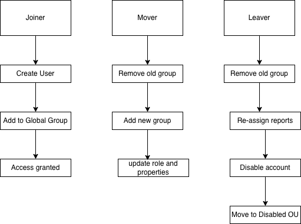
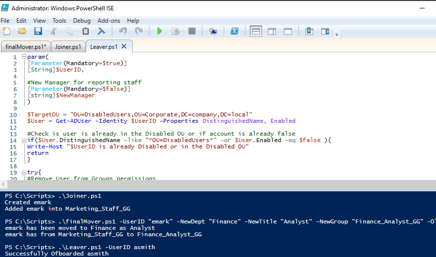

# Identity Lifecycle Automation Lab
## PowerShell-Based Joiner / Mover / Leaver (JML) Suite

### Project Overview
This project demonstrates the development of an Identity Lifecycle Management (JML) automation framework using PowerShell and Active Directory.

The project was designed around core identity governance principles: enforcing least privilege through role-based access control, preventing permission creep through automated group management during role transitions and maintaining audit visibility through OU-based account retention rather than immediate deletion. Each phase of the automation suite reflects a deliberate security decision, not just a technical implementation.

Rather than starting with a complete solution, this project was built iteratively—from basic scripting to a structured automation suite—reflecting how real-world IAM environments evolve over time.

### System Architecture & Workflow


*Workflow of automated lifecyle scripts*

### Active Directory OU Diagram


*Separation of Users and Groups to support RBAC and AGDLP nesting* 

The focus was to:
- Implement RBAC using AGDLP design
- Automate Joiner, Mover, and Leaver processes
- Reduce manual errors and permission creep
- Maintain referential integrity (manager/subordinate relationships)

All scripts have been tested in an isolated lab environment with screenshot documentation available.

---

## 📍 Table of Contents
- [Part 1 — On-Premises Infrastructure & Lifecycle](#part-1--on-premises-infrastructure--lifecycle)
 - [Technical Evolution](#technical-evolution)
  - [Phase 1 — Foundational Scripting](#phase-1--foundational-scripting-manual--hardcoded-automation)
  - [Phase 2 — Structured Automation](#phase-2--structured-automation-betternewou)
  - [Phase 3 — Joiner Automation](#phase-3--joiner-automation-reusable-provisioning)
  - [Phase 4 — Mover Automation](#phase-4--mover-automation-access-control--permission-integrity)
  - [Phase 5 — Leaver Automation](#phase-5--leaver-automation-offboarding--security)
- [Troubleshooting Case Study](#troubleshooting-case-study)
- [Technical Skills Demonstrated](#technical-skills-demonstrated)
- [Project Outcome](#project-outcome)
- [Part 2 — Hybrid Cloud Integration (Entra ID)](#part-2--hybrid-cloud-integration-entra-id)
 - [Technical Implementation](#technical-implementation)

---
# Part 1 - On Premise Infrastructure and Lifecycle

## Technical Evolution

### Phase 1 — Foundational Scripting (Manual → Hardcoded Automation)

**Initial Script: OU, Groups, and Users (NewOU)**

The first script created:
- Department OU structure
- Global and Domain Local groups
- Group nesting (RBAC model)
- Users with assigned roles

This version was fully hardcoded, including:
- OU paths
- User attributes
- Group names

While functional, it had several limitations:
- Not reusable across departments
- Required manual updates for every change
- Repeated commands for each user

[View script here](scripts/1-NewOU-Basic.ps1)

---

### Phase 2 — Structured Automation (BetterNewOU)

The second iteration focused on reducing repetition and improving scalability.

**Improvements introduced:**
- Centralized environment variables (Domain, OU paths)
- Dynamic naming using `$Dept`
- Use of arrays to store user data
- Use of `foreach` loops for bulk user creation
- Continued use of splatting for readability

**Example improvement:**
` powershell
foreach ($User in $UserToCreate) {
    New-ADUser @UserParams
}`
This transformed the script from:

**Manual per-user creation**

into:

**Scalable bulk provisioning**

[View script here](scripts/2-NewOU-Iterative.ps1)

---

## Phase 3 — Joiner Automation (Reusable Provisioning)

### First Joiner Script

This was the transition from environment setup → lifecycle automation.

**Key additions:**
- User existence validation
- Try/Catch error handling
- Standardized user creation process

At this stage, the script was still partially static but introduced control logic.

[View script here](scripts/3a-static-Joiner.ps1)

### Parameterized Joiner Script

The joiner script was redesigned to support dynamic input using a `param()` block.

**Key improvements:**
- Accepts user input at runtime:
  - Name
  - UserID
  - Department
  - Role
- Removes need to modify script code
- Enforces consistent provisioning logic

This marked the shift to:

**Reusable automation for help desk or IT operations**

**Implementation Note**
- Instead of hardcoding user data, this script uses a param() block to accept dynamic input at runtime, allowing the same script to be used for any department. Also includes validation to prevent duplicate account creation.

Powershell: 

``param(``

``[string]$Dept = "Marketing",``

``[string]$FirstName = "Elena",``

``[string]$LastName = "Mark",``

``[string]$UserID = "emark",``

``[string]$Title = "$($Dept) Staff"``

``)``

[View Joiner script here](scripts/3b-joiner.ps1)

---

## Phase 4 — Mover Automation (Access Control & Permission Integrity)

### Problem

User transitions (role or department changes) are a primary cause of permission creep.

### Role-Based Mover

The first mover script handled role changes within a department.

**Key logic:**
- Check if user already has the target role
- Update user attributes
- Perform a group membership swap
  - Remove old role group
  - Add new role group

This ensured RBAC enforcement during promotions.

[View role mover script](scripts/4a-role-mover.ps1)

### Department Mover

A second script handled cross-department moves, introducing:
- OU relocation
- Manager reassignment
- Role updates

This expanded the logic beyond simple role changes.

[View department mover](scripts/4b-department-mover.ps1)

### Master Mover Script (Consolidation)

The final mover script combined both scenarios into a single parameter-driven tool.

**Key features:**
- Supports:
  - Role changes
  - Department transfers
- Uses conditional logic to handle optional inputs:
  - `ReportsToID`
  - `ReportsFromID`
- Updates:
  - Title
  - Department
  - Manager relationships
  - OU location
- Maintains referential integrity for reporting structures
- Enforces clean access transitions:
  - Remove old group
  - Add new group

This represents a shift from:

**Single-purpose scripts**

to:

**Modular lifecycle automation**

**Implementation Note**
- To prevent Permission Creep, the Mover script identifies the user's old role-based group and removes it in the same operation. This ensures the user only has the access required for their current role.

Powershell: 

``Add-ADGroupMember -Identity $NewGroup -Members $UserID -ErrorAction Stop``

``Remove-ADGroupMember -Identity $OldGroup -Members $UserID -Confirm:$false -ErrorAction Stop``

``Write-Host "$UserId has from $OldGroup to $NewGroup" ``

[View comprehensive Mover script here](scripts/4c-mover.ps1)

---

## Phase 5 — Leaver Automation (Offboarding & Security)

The leaver script represents the most complete stage of the lifecycle.

### Key Capabilities

**1. Pre-check Validation**
- Detects if the user is already disabled or moved
- Prevents duplicate execution

**2. Security Scrubbing**
- Removes all group memberships except Domain Users
- `Get-ADPrincipalGroupMembership | Remove-ADGroupMember`
- This ensures a zero-access state

**3. Referential Integrity**
- Identifies users reporting to the departing employee
- Reassigns them to a new manager

**4. Account Decommissioning**
- Disables the account
- Moves it to a secured Disabled Users OU
- This avoids deletion while maintaining audit visibility

**Implementation Note**
- Before disabling a manager's account, the script identifies and reassigns all subordinates to prevent "orphaned" reporting lines:

Powershell: 

``$Subordinate = Get-ADUser -Filter "Manager -eq '$($User.DistinguishedName)'"  ``

``if($Subordinate){
$Subordinate | Set-ADUser -Manager $NewManager 
Write-Host "Re-assigned $($Subordinate.Count) to $NewManager"``

[View Leaver script here](scripts/5-Leaver.ps1)

---

## Troubleshooting Case Study

**Issue**

During development, an error occurred when reassigning subordinates after moving a user.

**Root Cause**

Moving the user object changed its Distinguished Name (DN) immediately, making the stored reference invalid.

**Resolution**

The execution order was corrected:
1. Reassign subordinates
2. Remove access
3. Disable account
4. Move object

**Key Learning**
- Active Directory attributes update in real time
- Execution order is critical in automation workflows

---

## Technical Skills Demonstrated

**Active Directory & IAM**
- OU design and organization
- RBAC implementation (AGDLP)
- Group-based access control
- Identity lifecycle management (JLM)

**PowerShell**
- Parameterized scripting (`param`)
- Splatting
- Try/Catch error handling
- Pipeline processing
- Arrays and loops (`foreach`)
- Conditional logic

**Security & Governance**
- Permission creep prevention
- Referential integrity management
- Secure offboarding practices
- Least privilege enforcement

**Testing & Documentation**
- Isolated lab environment testing
- Screenshot documentation of script execution
- Troubleshooting methodology documentation

---

## Project Outcome

This project demonstrates the transition from:

**Manual AD administration**

to:

**Automated identity lifecycle management**

It reflects real IAM responsibilities, including:
- Standardized onboarding
- Controlled access transitions
- Secure and auditable offboarding

---
**Execution and Results**

- To validate the automation suite a full lifecycle test was done in the lab environment. The screenshot demonstrates:

1. Joiner: Successful provisioning of `emark` into the Marketing OU.

2. Mover: A seamless transition of `emark` to the Finance department, including a role-based group swap.

3. Leaver: Secure offboarding of `asmith` including permission removal and relocation of the User object to the Disabled Users OU.



---

# Part 2 - Hybrid Cloud Integration (Entra ID)

## Technical Implementation

Following the on-premises setup, the next step was extending the local directory to the cloud.

#### Implementation of Microsoft Entra Connect

- Downloaded and installed the Microsoft Entra Connect Sync Agent on the Windows Server 2022 Domain Controller.
- Configured Domain and OU filtering to target the `Corporate` OU specifically.
- This ensures only laboratory users and groups are synchronized, maintaining a clean cloud tenant.

#### Implementation Note
> By selecting "Sync selected domains and OUs," I prevented built-in system accounts and local infrastructure groups from cluttering the Entra ID portal, adhering to standard production best practices.

[View Entra Connect Download](images/cloud-01-entra-connect-download.png)
[View Domain/OU Filtering configuration](images/cloud-02-sync-ou.png)

---

#### Synchronization Troubleshooting (Time Skew)

The first synchronization attempt failed to populate users in the Entra ID portal.

**Issue Identified:**
- The local VM system clock had drifted from the actual time.
- Entra ID authentication tokens require precise time synchronization; the mismatch caused the sync agent to fail authentication with the cloud service.

**Resolution:**
- Reconfigured the Windows Time service to sync from an external NTP source (time.windows.com) instead of the inaccurate Local CMOS clock:
- Triggered a manual delta sync via PowerShell:

```powershell:

w32tm /config /manualpeerlist:"time.windows.com,0x8" /syncfromflags:manual /update
Restart-Service W32Time
w32tm /resync /force
```

**Key Learning**
- In a hybrid environment, time synchronization is a critical dependency. Even a small drift can invalidate security tokens and break the identity pipeline between on-premises and cloud.

---

***Verification of Cloud Identities***

Once the time sync was resolved, the synchronization cycle completed successfully.

**Results:**
- Verified 18 users found within the Entra ID **All Users** blade.
- Confirmed identities are marked as **Synced from on-premises**, maintaining the local AD as the Source of Authority.
- Identities are created in an **Unlicensed** state, requiring a secondary automation step for service activation.

[View 18 users synchronized in Entra ID](images/cloud-03-synced-users.png)


